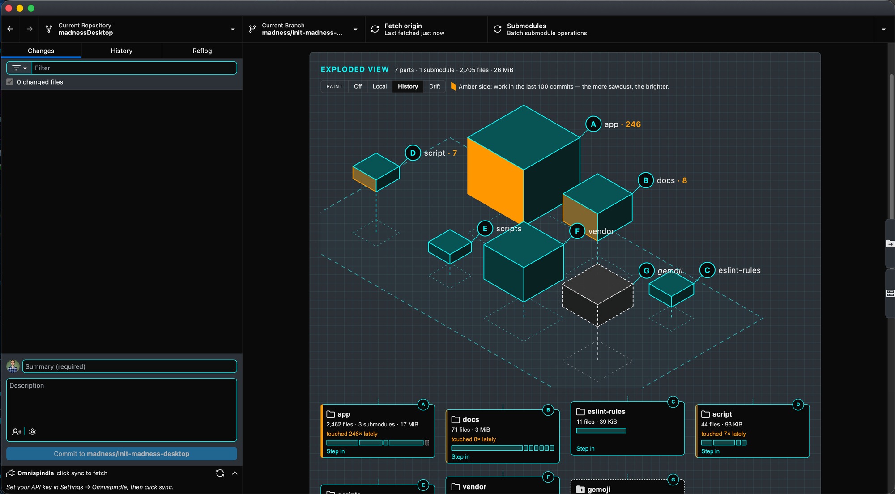
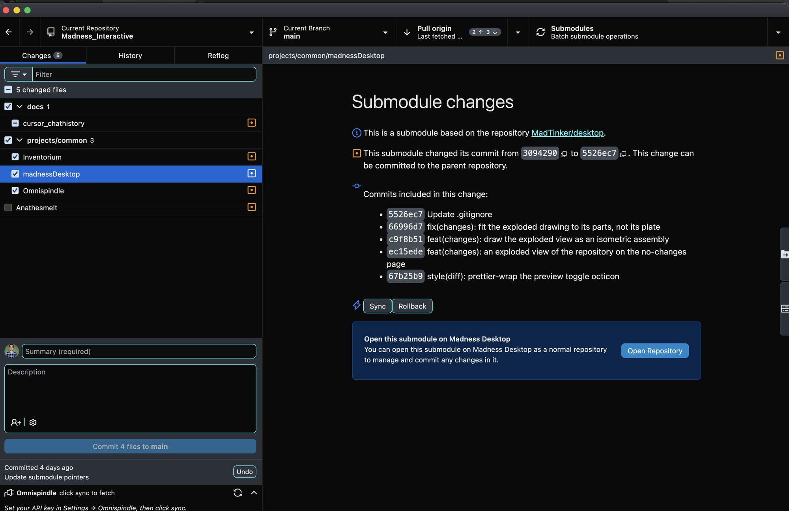

# Madness Desktop

A [GitHub Desktop](https://github.com/desktop/desktop) fork wired into the **madness_interactive** workshop — multi-machine git coordination, composable git hooks, and live workshop todos, on top of the familiar Desktop git client. Built with [Electron](https://www.electronjs.org/), [TypeScript](https://www.typescriptlang.org), and [React](https://reactjs.org/).

> **Early build, build-it-yourself.** The way to get Madness Desktop is to build it from source — there's no maintained download. (The [Releases](https://github.com/MadnessEngineering/madnessDesktop/releases) page has a few old builds, but they're months behind `main` and missing most of what's below.)



## Getting it

```sh
git clone https://github.com/MadnessEngineering/madnessDesktop.git
cd madnessDesktop
yarn
make install      # production build, quits the running app, installs into /Applications
```

Your settings live in `~/Library/Application Support/Madness Desktop`, outside the app, so reinstalling keeps them.

## Keeping it updated

Pull and rebuild:

```sh
git pull
make install
```

`make install-app` skips the build and just re-installs the last one (and refreshes the `madhub` link).

## What makes it different?

Everything GitHub Desktop does, plus workshop coordination:

- **[Hook Loadouts](https://github.com/MadnessEngineering/madnessDesktop/blob/HEAD/docs/hook-loadouts.md)** — install and toggle bundles of git-hook scripts per repository from the UI. A thin `.d/` dispatcher lets multiple scripts stack on the same hook without clobbering each other, and recent hook runs show up in a log in the Changes sidebar. Presets: `mad-standard`, `deploy-enabled`, `desktop-dev`, `minimal`.
- **[MQTT integration](https://github.com/MadnessEngineering/madnessDesktop/blob/HEAD/docs/mqtt-integration.md)** — a hook script publishes each commit, with its active todo, to an MQTT broker, under a per-machine topic your own tools can subscribe to.
- **[Omnispindle todos](https://github.com/MadnessEngineering/madnessDesktop/blob/HEAD/docs/ecosystem.md)** — a live todo list from the Omnispindle MCP server in the Changes sidebar, plus a `todo-prefix` hook that stamps the active todo ID into your commit message.
- **Exploded view** — when a repository has no local changes, flip the page to an instruction-manual drawing of it: every folder a lettered part sized by weight, submodules as dashed crates, tool dot-folders set aside, and a materials list underneath. Step into a folder to take it apart too, or into a submodule to switch the app to it — and back out again from the breadcrumb. **Paint** marks where the work is, one amber side per part: your uncommitted changes (also reachable from the diff header while you have them), the last 100 commits' history, or submodules drifting off their pins.
- **Subrepo tooling** — submodules nest under their monorepo as collapsible folders, un-added submodules appear as "ghost" rows with one-click **Add**, submodule commit history shows up in diffs, and push/pull steps through each submodule before the parent.

  
- **Madness Themes** — a pack of custom color schemes with a picker in **Preferences → Appearance** and hotkeys to cycle through them.
- **Auto-switch monitor** — automatically focuses whichever repository just picked up new changes.
- **[`madhub` CLI](#the-madhub-cli)** — open, clone, group, and run submodule ops from the terminal.

## The `madhub` CLI

Install it from the app menu: **Madness Desktop → Install Command Line Tool…** (symlinks `/usr/local/bin/madhub`).

| Command | What it does |
|---------|--------------|
| `madhub` | Open the current directory |
| `madhub open [path]` | Open the provided path |
| `madhub add [path] -g <group>` | Add the repo to the list and file it under `<group>` (created if new) |
| `madhub clone [-b branch] [-g group] <url>` | Clone a repo by URL or `owner/name` (e.g. `torvalds/linux`), optionally checking out a branch and filing it under a group |
| `madhub sub <op> [path] [sub]` | Submodule op: `init`, `pull`, `push` (repo-wide, or one `<sub>`); `sync`, `rollback` (need `<sub>`) |
| `madhub foreach <cmd> [-r] [path]` | Run a shell command across every submodule and print the combined output |
| `madhub group <ls\|create\|rm> [name]` | List, create, or remove custom groups |
| `madhub fav [path]` | Toggle the repo as a favorite |

## The Madness ecosystem

Madness Desktop is one node in a larger workshop coordination system — git events flow over MQTT to the [Omnispindle](https://github.com/MadnessEngineering/Omnispindle) MCP server and the [Inventorium](https://github.com/MadnessEngineering/Inventorium) dashboard. See [docs/ecosystem.md](https://github.com/MadnessEngineering/madnessDesktop/blob/HEAD/docs/ecosystem.md) for how the pieces fit together and how to bring a new machine onto the broker.

## Documentation

- [Installation & data directories](https://github.com/MadnessEngineering/madnessDesktop/blob/HEAD/docs/installation.md)
- [Authentication](https://github.com/MadnessEngineering/madnessDesktop/blob/HEAD/docs/authentication.md)
- [Hook Loadouts](https://github.com/MadnessEngineering/madnessDesktop/blob/HEAD/docs/hook-loadouts.md)
- [MQTT integration](https://github.com/MadnessEngineering/madnessDesktop/blob/HEAD/docs/mqtt-integration.md)
- [The Madness ecosystem](https://github.com/MadnessEngineering/madnessDesktop/blob/HEAD/docs/ecosystem.md)
- [Known issues](https://github.com/MadnessEngineering/madnessDesktop/blob/HEAD/docs/known-issues.md)
- [All docs](https://github.com/MadnessEngineering/madnessDesktop/tree/HEAD/docs)

## Building & contributing

To set up a development environment, see [`docs/contributing/setup.md`](https://github.com/MadnessEngineering/madnessDesktop/blob/HEAD/docs/contributing/setup.md). The [`.github/CONTRIBUTING.md`](https://github.com/MadnessEngineering/madnessDesktop/blob/HEAD/.github/CONTRIBUTING.md) guide covers the source layout, and the [docs](https://github.com/MadnessEngineering/madnessDesktop/tree/HEAD/docs) folder has the rest.

Found a bug or want to suggest something? Open an [issue](https://github.com/MadnessEngineering/madnessDesktop/issues/new/choose). The [Code of Conduct](https://github.com/MadnessEngineering/madnessDesktop/blob/HEAD/CODE_OF_CONDUCT.md) applies to all project interactions.

## License

**[MIT](LICENSE)**

The MIT license grant is not for GitHub's trademarks, which include the logo designs. GitHub reserves all trademark and copyright rights in and to all GitHub trademarks. GitHub's logos include, for instance, the stylized Invertocat designs that include "logo" in the file title in the following folder: [logos](https://github.com/MadnessEngineering/madnessDesktop/tree/HEAD/app/static/logos).

GitHub® and its stylized versions and the Invertocat mark are GitHub's Trademarks or registered Trademarks. When using GitHub's logos, be sure to follow the GitHub [logo guidelines](https://github.com/logos).
